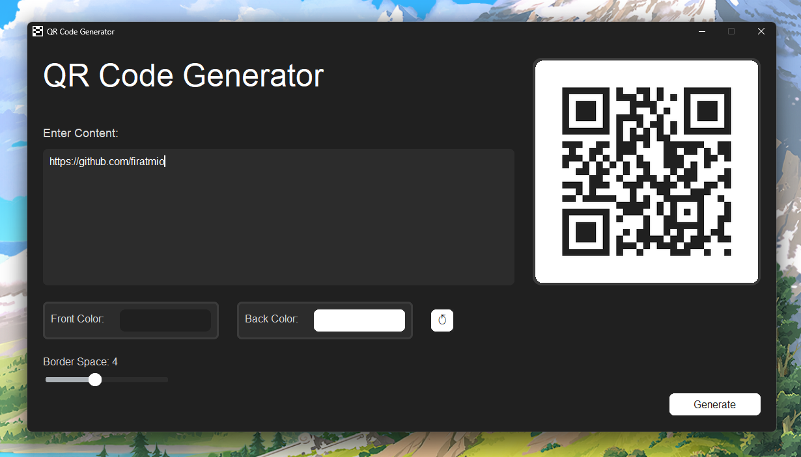

<div align="center">

<p align="center">
  
</p>

# 🔳 QR Code Generator

**Modern & Lightweight QR Code Generator with Python GUI**


*Generate QR codes instantly with a sleek CustomTkinter interface.*


[](https://github.com/firatmio/qr-code-generator)
[](https://github.com/firatmio/qr-code-generator)
[](https://github.com/firatmio/qr-code-generator)

</div>

---

## 📖 Overview

**QR Code Generator** is a lightweight **Python desktop application** that allows you to quickly **create custom QR codes** from text, links, or any string input.  
It features a clean and modern **GUI built with CustomTkinter** for ease of use.

---

## ✨ Features

- 🎨 **Modern GUI** with [CustomTkinter](https://github.com/TomSchimansky/CustomTkinter)
- ⚡ **Instant QR generation**
- 💾 **Save QR codes** as images (PNG, JPG)
- 🔍 **Preview before saving**
- 🖥️ **Cross-platform support** (Windows, Linux, macOS)

---

## 🚀 Quick Start

### 1. Clone the Repository

```bash
git clone https://github.com/firatmio/qrcodegenerator.git
cd qrcodegenerator
```

### 2. Install Requirements

```bash
pip install -r requirements.txt
```

**requirements.txt**

```txt
qrcode
Pillow
customtkinter
```

### 3. Run the App

```bash
python main.py
```

---

## 🖼️ Screenshot

> *Example UI after generating a QR code:*

<p align="center">
  
</p>

---

## ⚙️ How It Works

1. Launch the app.
2. Enter your text, URL, or string into the input field.
3. Click **Generate** to instantly create a QR code.
4. Preview the generated QR code.
5. Save it as an image for later use.

---

## 🛠️ Tech Stack

- **Language**: Python 3.10+
- **QR Generation**: qrcode
- **GUI Framework**: CustomTkinter + Tkinter
- **Image Handling**: Pillow (PIL)

---

## 🤝 Contribution

Contributions are welcome! 🚀

1. Fork the repo
2. Create your branch (`git checkout -b feature/amazing-feature`)
3. Commit changes (`git commit -m 'Add amazing feature'`)
4. Push branch (`git push origin feature/amazing-feature`)
5. Open a Pull Request

---

## 📄 License

Apache 2.0 - see [LICENSE](LICENSE) for details.

---

## 🏷️ Version History

- **v0.1.0** – First beta release  
  - Modern GUI with CustomTkinter  
  - QR code generation  
  - Save as image feature  

---

<div align="center">

**⭐ If you find this project useful, don’t forget to star it!**  
**Created with ❤️ by [Fırat Tuna Arslan](https://github.com/firatmio)**

</div>
